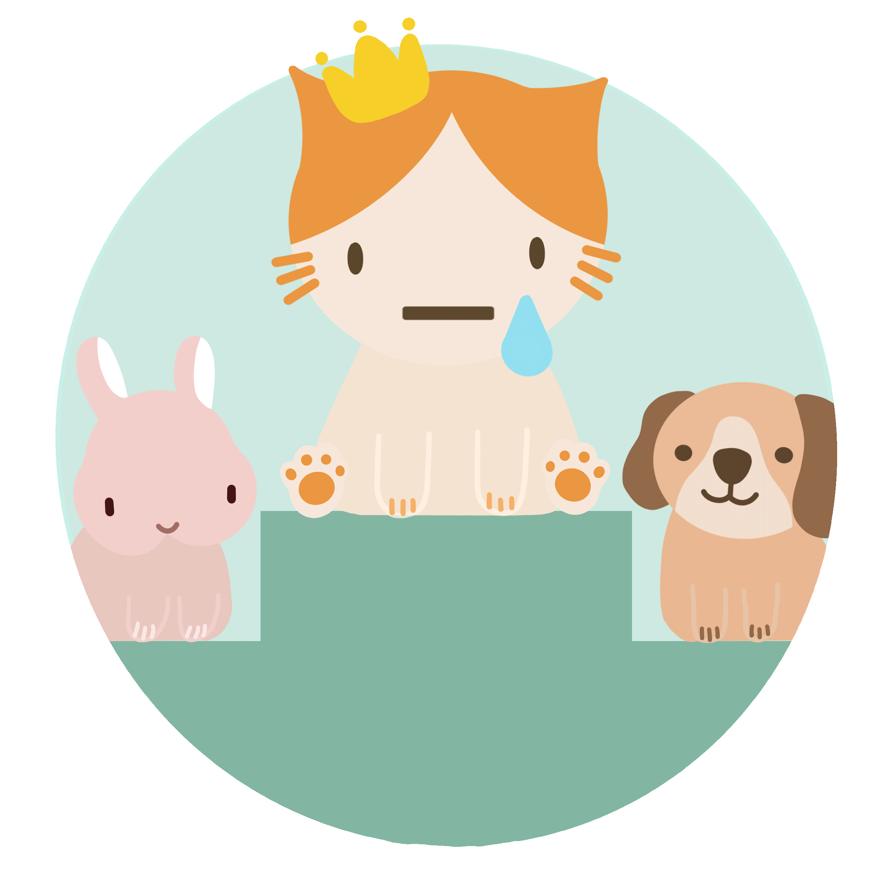

<!-- markdownlint-disable MD033 MD041 -->

<h1 align="center">Wall of Shame</h1>

Wall of Shame is an application that empowers people to curb procrastination by challenging their friends in completing tasks. It is the modern-day, responsible equivalent of betting against your friends to see who can finish a challenge, with the key difference being that instead of betting money, participants place their reputations on the line instead. With such high stakes in the form of public shaming, Wall of Shame is a fun, harmless (mostly) and effective approach to tackling procrastination with your friends.

Public Link on Netlify at [https://wallofshame.netlify.app/](https://wallofshame.netlify.app/).

Backend API hosted on Heroku.

## Team members and contributions

| Name                 | Matriculation No. | Role                              |
| -------------------- | ----------------- | --------------------------------- |
| Low Jie Feng         | A0201747J         | Backend, Database                 |
| Sieow Je Min         | A0167650B         | Frontend, UI/UX, Deployment       |
| Wang Luo             | A0180092L         | Frontend, UI/UX, Authentication   |
| Yifan Zhang          | A0204736H         | Art and Design, UI/UX, Frontend   |

## Deploying Locally

Please refer to `README.md` of the respective repositories for local deployment isntructions. 